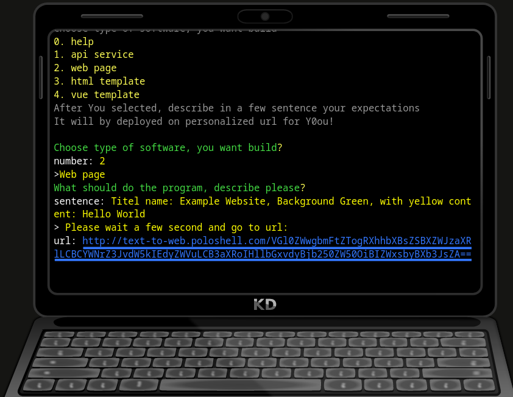

#  https://app.poloshell.com/





> This is example of using [jQuery Terminal](https://terminal.jcubic.pl/) to create Fake Linux System. It's work in progress. Check [GitHub Repo](https://github.com/jcubic/fake-linux-terminal) for more information.
>
> You can call it a fake command line website, that emulates real GNU/Linux system.
>
> This is [Open Source](https://en.wikipedia.org/wiki/Open_source) and [Free software](https://en.wikipedia.org/wiki/Free_software).
>
> Laptop Image: source: [OpenClipart](https://openclipart.org/); License - Public Domain ([CC-0](https://creativecommons.org/share-your-work/public-domain/cc0/)).
>
> Copyright 2022 [Jakub T. Jankiewicz](https://jakub.jankiewicz.org) - relased under GNU Affero General Public License 3 or later.
> 
## License

```
    Copyright (C) 2022 Jakub T. Jankiewicz <https://jcubic.pl/me>

    This program is free software: you can redistribute it and/or modify
    it under the terms of the GNU Affero General Public License as published by
    the Free Software Foundation, either version 3 of the License, or
    (at your option) any later version.

    This program is distributed in the hope that it will be useful,
    but WITHOUT ANY WARRANTY; without even the implied warranty of
    MERCHANTABILITY or FITNESS FOR A PARTICULAR PURPOSE.  See the
    GNU General Public License for more details.

    You should have received a copy of the GNU Affero General Public License
    along with this program.  If not, see <http://www.gnu.org/licenses/>
```
